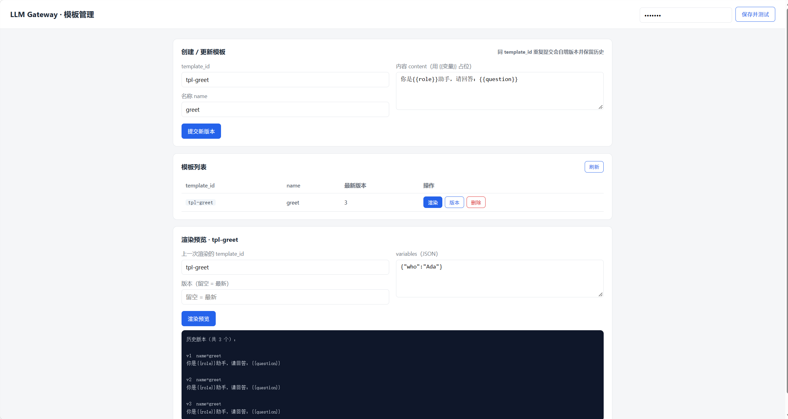

# LLM Gateway

OpenAI 兼容的自建 LLM 网关：智能路由、容错（retry/fallback/circuit breaker）、分层限流、SSE 流式、结构化输出校验与自动修复、用量/追踪/计费（恰好一次）。

规格依据：[docs/SPEC.md](../docs/SPEC.md)

## 快速开始

### Windows（PowerShell）

```powershell
# 1. 环境
python -m venv .venv
.\.venv\Scripts\Activate.ps1      # Windows 激活虚拟环境
pip install -r requirements-dev.txt

# 2. 配置（填入各 Provider Key；密钥不硬编码，均从环境变量读取）
#    编辑 .env 填入真实 Key（.env 已随项目提供，勿提交到仓库）
$env:DEEPSEEK_API_KEY = "sk-your-key"   # 或临时设置单个变量

# 3. 启动（务必用虚拟环境解释器；系统 python 未装项目依赖，
#    会报 ModuleNotFoundError: No module named 'dotenv'）
.\.venv\Scripts\python.exe -m uvicorn app.main:app --host 0.0.0.0 --port 8000

# 4. 冒烟
curl.exe http://127.0.0.1:8000/healthz
curl.exe http://127.0.0.1:8000/v1/models -H "Authorization: Bearer sk-gateway-dev"
```

### Linux / macOS（Bash）

```bash
# 1. 环境
python -m venv .venv
source .venv/bin/activate         # Linux/macOS 激活虚拟环境
pip install -r requirements-dev.txt

# 2. 配置（填入各 Provider Key；密钥不硬编码，均从环境变量读取）
#    编辑 .env 填入真实 Key（.env 已随项目提供，勿提交到仓库）
export DEEPSEEK_API_KEY="sk-your-key"   # 或临时设置单个变量

# 3. 启动（务必用虚拟环境解释器；系统 python 未装项目依赖，
#    会报 ModuleNotFoundError: No module named 'dotenv'）
.venv/bin/python -m uvicorn app.main:app --host 0.0.0.0 --port 8000

# 4. 冒烟
curl http://127.0.0.1:8000/healthz
curl http://127.0.0.1:8000/v1/models -H "Authorization: Bearer sk-gateway-dev"
```

## 调用示例

### 普通对话（非流式）

**Windows（PowerShell）：** 多行命令用反引号 `` ` `` 续行；JSON Body 先写入临时文件再通过 `--data-binary` 发送（避免引号转义问题）。

```powershell
$body = '{"model":"deepseek-chat","messages":[{"role":"user","content":"1+1=?"}],"stream":false}' |
    Out-File "$env:TEMP\req.json" -Encoding ascii -NoNewline

curl.exe -X POST "http://127.0.0.1:8000/v1/chat/completions" `
  -H "Authorization: Bearer sk-gateway-dev" `
  -H "Content-Type: application/json" `
  --data-binary "@$env:TEMP\req.json"
```

**Linux / macOS（Bash）：** 单引号包裹 JSON、`\` 续行，无需临时文件。

```bash
curl -X POST "http://127.0.0.1:8000/v1/chat/completions" \
  -H "Authorization: Bearer sk-gateway-dev" \
  -H "Content-Type: application/json" \
  -d '{"model":"deepseek-chat","messages":[{"role":"user","content":"1+1=?"}],"stream":false}'
```

### 结构化输出（JSON Schema 校验 + 自动修复）

**Windows（PowerShell）：**

```powershell
$body = '{"model":"deepseek-chat","messages":[{"role":"user","content":"解析用户意图"}],
         "response_format":{"type":"json_schema","json_schema":{"name":"intent","schema":{"type":"object","properties":{"intent":{"type":"string"}},"required":["intent"]}}}}' |
    Out-File "$env:TEMP\req.json" -Encoding ascii -NoNewline

curl.exe -X POST "http://127.0.0.1:8000/v1/chat/completions" `
  -H "Authorization: Bearer sk-gateway-dev" `
  -H "Content-Type: application/json" `
  --data-binary "@$env:TEMP\req.json"
```

**Linux / macOS（Bash）：**

```bash
curl -X POST "http://127.0.0.1:8000/v1/chat/completions" \
  -H "Authorization: Bearer sk-gateway-dev" \
  -H "Content-Type: application/json" \
  -d '{"model":"deepseek-chat","messages":[{"role":"user","content":"解析用户意图"}],
       "response_format":{"type":"json_schema","json_schema":{"name":"intent","schema":{"type":"object","properties":{"intent":{"type":"string"}},"required":["intent"]}}}}'
```

### 流式输出（Server-Sent Events）

**Windows（PowerShell）：** Windows PowerShell 中 `curl` 是 `Invoke-WebRequest` 的别名，必须使用 `curl.exe` 才能支持 `-H`/`--data-binary` 等参数；流式场景还需加 `-N`（`--no-buffer`）关闭缓冲，才能看到逐行输出的效果。幂等写法：先把 JSON 写入临时文件再发送，避免引号转义问题。

```powershell
$json = '{"model":"deepseek-chat","messages":[{"role":"user","content":"数到5"}],"stream":true}'

Set-Content -Path "$env:TEMP\req.json" -Value $json -Encoding UTF8 -NoNewline

curl.exe -s -N -X POST "http://127.0.0.1:8000/v1/chat/completions" `
  -H "Authorization: Bearer sk-gateway-dev" `
  -H "Content-Type: application/json" `
  --data-binary "@$env:TEMP\req.json"
```

**Linux / macOS（Bash）：** `-N` 用于关闭缓冲，逐行输出 SSE 事件。

```bash
curl -s -N -X POST "http://127.0.0.1:8000/v1/chat/completions" \
  -H "Authorization: Bearer sk-gateway-dev" \
  -H "Content-Type: application/json" \
  -d '{"model":"deepseek-chat","messages":[{"role":"user","content":"数到5"}],"stream":true}'
```

响应为多条 `data: {...}` 事件，末行 `data: [DONE]` 表示结束。也可直接使用 Swagger UI
交互式测试：浏览器打开 `http://127.0.0.1:8000/docs`。

### 模板管理 HTTP 端点（/v1/templates）

模板管理原本仅 CLI 可用（`python -m cli.gateway_cli templates ...`），现已暴露为
REST 端点，复用网关统一 Bearer 鉴权（默认 key 见 `config/gateway.yaml` 的 `api_keys`；
若设置了 `GATEWAY_API_KEYS` 环境变量，则以环境变量为准，YAML 中的 key 被忽略）。

语义约定：
- 每次 `POST` upsert 自动自增 `version` 并保留历史版本；
- **模板不存在 → 404 `not_found`**（GET/DELETE/render/chat 引用均一致）；
- **输入类错误 → 400**：缺模板变量 `prompt_missing_vars`、模板语法错误/参数校验失败 `invalid_request`。

| 方法 | 路径 | 说明 |
|---|---|---|
| GET | `/v1/templates` | 列出所有模板（每个 template_id 的最新版本） |
| GET | `/v1/templates/{id}` | 查询模板，`?version=N` 取指定版本，缺省最新 |
| GET | `/v1/templates/{id}/versions` | 列出全部历史版本（升序） |
| POST | `/v1/templates` | 新增版本（自增 version、保留历史） |
| POST | `/v1/templates/{id}/render` | 用变量预览渲染结果（不调用上游） |
| DELETE | `/v1/templates/{id}` | 删除；`?version=N` 删单版本，缺省删全部（响应含 `deleted` 数量） |

**网页管理界面：** 网关内置了一个零依赖的单文件管理页（增删改查 + 版本查看 +
渲染预览），由网关同源提供，浏览器打开即用、无跨域问题：

```
http://127.0.0.1:8000/ui/templates        # 友好短路径
http://127.0.0.1:8000/ui/templates.html   # 等价（静态挂载）
```

页面顶部填入网关 API Key（`sk-test` 或当前合法 key）后点「保存并测试」，后续所有
操作自动携带 `Authorization: Bearer ...` 头。Key 仅保存在浏览器 `localStorage`，
数据操作仍受 `/v1/templates` 统一鉴权保护。HTML 本身可匿名访问，页面源码见
`app/static/templates.html`。



**Windows（PowerShell）：** 与上方示例相同，先写临时文件再 `--data-binary` 发送。
⚠️ 模板内容含中文时，临时文件须用 **UTF8** 编码（`-Encoding ascii` 会破坏中文），
故此处用 `Set-Content ... -Encoding UTF8`。

```powershell
# 1) 创建/更新模板（返回新版本号；再次调用同一 id 会自增 version）
$json = '{"template_id":"tpl-greet","name":"greet","content":"你是{{role}}助手，请回答：{{question}}"}'
Set-Content -Path "$env:TEMP\tpl.json" -Value $json -Encoding UTF8 -NoNewline

curl.exe -X POST "http://127.0.0.1:8000/v1/templates" `
  -H "Authorization: Bearer sk-gateway-dev" `
  -H "Content-Type: application/json" `
  --data-binary "@$env:TEMP\tpl.json"

# 2) 列出所有模板
curl.exe http://127.0.0.1:8000/v1/templates -H "Authorization: Bearer sk-gateway-dev"

# 3) 查询模板（缺省最新；?version=1 取历史版本）
curl.exe http://127.0.0.1:8000/v1/templates/tpl-greet -H "Authorization: Bearer sk-gateway-dev"
curl.exe "http://127.0.0.1:8000/v1/templates/tpl-greet?version=1" -H "Authorization: Bearer sk-gateway-dev"

# 4) 列出历史版本
curl.exe http://127.0.0.1:8000/v1/templates/tpl-greet/versions -H "Authorization: Bearer sk-gateway-dev"

# 5) 渲染预览（不调用上游，适合调试模板）
$json = '{"variables":{"role":"销售","question":"报价策略"}}'
Set-Content -Path "$env:TEMP\render.json" -Value $json -Encoding UTF8 -NoNewline

curl.exe -X POST "http://127.0.0.1:8000/v1/templates/tpl-greet/render" `
  -H "Authorization: Bearer sk-gateway-dev" `
  -H "Content-Type: application/json" `
  --data-binary "@$env:TEMP\render.json"

# 6) 删除（?version=1 删指定版本；缺省删全部）
curl.exe -X DELETE "http://127.0.0.1:8000/v1/templates/tpl-greet?version=1" `
  -H "Authorization: Bearer sk-gateway-dev"
curl.exe -X DELETE http://127.0.0.1:8000/v1/templates/tpl-greet -H "Authorization: Bearer sk-gateway-dev"
```

**Linux / macOS（Bash）：** 单引号包裹 JSON 天然无转义问题，无需临时文件。

```bash
# 创建/更新
curl -X POST "http://127.0.0.1:8000/v1/templates" \
  -H "Authorization: Bearer sk-gateway-dev" \
  -H "Content-Type: application/json" \
  -d '{"template_id":"tpl-greet","name":"greet","content":"你是{{role}}助手，请回答：{{question}}"}'

# 渲染预览
curl -X POST "http://127.0.0.1:8000/v1/templates/tpl-greet/render" \
  -H "Authorization: Bearer sk-gateway-dev" \
  -H "Content-Type: application/json" \
  -d '{"variables":{"role":"销售","question":"报价策略"}}'

# 列出 / 查询 / 删除
curl http://127.0.0.1:8000/v1/templates -H "Authorization: Bearer sk-gateway-dev"
curl "http://127.0.0.1:8000/v1/templates/tpl-greet?version=1" -H "Authorization: Bearer sk-gateway-dev"
curl -X DELETE "http://127.0.0.1:8000/v1/templates/tpl-greet?version=1" -H "Authorization: Bearer sk-gateway-dev"
```

聊天中引用模板：在 `POST /v1/chat/completions` 请求体中通过扩展字段
`template_id` / `template_version`（缺省最新）/ `template_vars` 注入，渲染结果作为
system 消息参与对话：

```json
{"model":"deepseek-chat",
 "messages":[{"role":"user","content":"hello"}],
 "template_id":"tpl-greet",
 "template_vars":{"role":"销售","question":"报价策略"}}
```

与 CLI 的分工：**HTTP 端点适合在线管理**（需要网关运行中，走统一 Bearer 鉴权）；
**CLI 适合离线运维**（无需启动网关，直接操作 SQLite）。CLI 用法见
「CLI 运维 → 模板管理（CLI）」。

## 测试

`tests/` 内的测试均为 **E2E（全 mock）+ 单测**：通过 `conftest.py` 启动一个模拟的
LLM 上游服务（`tests/mock_upstream.py`），并为每个用例创建指向该 mock 的网关实例。
**无需真实 Provider API Key，不访问外部网络。**

> 注意：请务必使用虚拟环境中的解释器（Windows 为 `.\.venv\Scripts\python.exe`，
> Linux/macOS 为 `.venv/bin/python`），不要用系统 `python`（系统解释器未安装
> pytest，会报 `No module named pytest`）。

运行全部测试：

```powershell
.\.venv\Scripts\python.exe -m pytest tests -v
```

只运行某个文件 / 某个用例：

```powershell
.\.venv\Scripts\python.exe -m pytest tests/test_api.py -v
.\.venv\Scripts\python.exe -m pytest tests/test_rate_limiter.py::test_token_bucket_capacity -v
```

带覆盖率：

```powershell
.\.venv\Scripts\python.exe -m pytest tests -v --cov=app --cov-report=term
```

### 常见问题：上游请求全部返回 502

若所有发往 mock 上游的用例（`test_chat_completion_nonstream` 等）都报
`Upstream error 502`，通常是 **Windows 系统代理**在作祟：httpx 默认 `trust_env=True`
会把对本地 `127.0.0.1` 端口的上游请求转发给系统代理，代理返回 502。

修复方式：网关上行的 HTTP 客户端禁用系统代理（`SharedHttpClientPool` 中已处理，
见 `app/core/http_client_pool.py`）：

```python
httpx.AsyncClient(timeout=timeout, limits=limits, trust_env=False)
```

## CLI 运维

### 用量 / 追踪 / 熔断查询

**Windows（PowerShell）：**

```powershell
.\.venv\Scripts\python.exe -m cli.gateway_cli summary
.\.venv\Scripts\python.exe -m cli.gateway_cli daily --days 7
.\.venv\Scripts\python.exe -m cli.gateway_cli traces --status error
.\.venv\Scripts\python.exe -m cli.gateway_cli circuit
```

**Linux / macOS（Bash）：**

```bash
.venv/bin/python -m cli.gateway_cli summary
.venv/bin/python -m cli.gateway_cli daily --days 7
.venv/bin/python -m cli.gateway_cli traces --status error
.venv/bin/python -m cli.gateway_cli circuit
```

### 模板管理（CLI）

模板管理也可全部走 CLI（与「调用示例 → 模板管理 HTTP 端点」操作同一 SQLite 存储，
无需启动网关服务、无需鉴权头，适合脚本化/离线运维）。子命令
`list / get / upsert / delete`，行为与 HTTP 端点一致：upsert 自增 version 保留历史，
`--version` 缺省取最新或删除全部。

**Windows（PowerShell）：**

```powershell
# 列出所有模板（每个 template_id 的最新版本）
.\.venv\Scripts\python.exe -m cli.gateway_cli templates list

# 查询模板（--version 缺省取最新版本）
.\.venv\Scripts\python.exe -m cli.gateway_cli templates get tpl-greet
.\.venv\Scripts\python.exe -m cli.gateway_cli templates get tpl-greet --version 1

# 新增版本（自增 version、保留历史）
.\.venv\Scripts\python.exe -m cli.gateway_cli templates upsert --id tpl-greet --name greet --content "你是{{role}}助手"

# 删除（--version 删除指定版本；缺省删除全部版本）
.\.venv\Scripts\python.exe -m cli.gateway_cli templates delete tpl-greet --version 1
.\.venv\Scripts\python.exe -m cli.gateway_cli templates delete tpl-greet
```

**Linux / macOS（Bash）：**

```bash
.venv/bin/python -m cli.gateway_cli templates list
.venv/bin/python -m cli.gateway_cli templates get tpl-greet --version 1
.venv/bin/python -m cli.gateway_cli templates upsert --id tpl-greet --name greet --content "你是{{role}}助手"
.venv/bin/python -m cli.gateway_cli templates delete tpl-greet
```

对应 HTTP 端点见「调用示例 → 模板管理 HTTP 端点」。

## 设计说明：协议选型（Chat Completions vs Responses API）

本项目上游统一走 **OpenAI Chat Completions 协议**（`POST /v1/chat/completions`），
而非 OpenAI 的 **Responses API**（`POST /v1/responses`）。原因：

- **多供应商统一**：网关覆盖 OpenAI、DeepSeek、Kimi、Qwen、Ollama。Chat Completions
  是事实上的兼容基线，上述供应商均实现该协议；Responses API 目前仅 OpenAI 官方支持，
  采用它会破坏「一个适配器通吃全部供应商」的架构对称性（路由/重试/熔断/计费都要分叉）。
- **成熟稳定**：工具调用、结构化输出（`response_format`）、SSE 流式在该协议上均有
  完善且一致的支持，候选切换时各供应商行为对齐。
- **生态工具链**：主流 SDK 与第三方网关均以 Chat Completions 为兼容目标。

代价是放弃了 Responses API 的服务端状态续接、内置工具（web search / file search /
code interpreter）、推理摘要等新特性——这些能力需网关自行编排。若未来某供应商需要
`web_search` 等内置工具，可在 openai-compat 适配器内演进，无需切换协议基线：

1. **透传工具参数**：在 `_build_body()` 中新增 `tools`/`tool_choice` 字段透传，
   把网关侧请求体中的工具声明映射到上游 Chat Completions 的 `tools` 参数；
   `response_format` 等既有约束字段保持不变。
2. **工具调用结果回传**：上游返回 `tool_calls` 增量时，适配器在 `StreamEvent`
   上增加工具调用事件类型，经现有流式通道原样转发；非流式则在 `AdapterResult`
   中携带 `tool_calls`。
3. **能力感知路由**：注册表为供应商标记 `capabilities`，路由层在候选过滤时跳过
   不支持目标工具的供应商，保证 fallback 链路不会回落到不支持的供应商。
4. **本地模拟兜底**：对无上游内置工具的供应商，可在网关侧用「声明工具 → 模型生成
   `tool_calls` → 网关执行本地搜索 → 结果注入下一轮 messages」的函数调用模式近似，
   在业务层与内置工具对齐。

如此既有供应商不受影响，新增能力只收敛在适配器与路由的少数几个点。

## 验收记录：真实双供应商模型 Fallback

演示环境配置：deepseek 的 `api_base_url` 临时指向不可达地址（用于强制触发重试→fallback），
kimi 未配置 `KIMI_API_KEY`，qwen 配置真实 Key。请求未指定 `model`，触发完整候选链。

请求（网关鉴权 key 为测试 key，此处占位）：

```bash
curl.exe -s -X POST "http://127.0.0.1:8000/v1/chat/completions" `
  -H "Authorization: Bearer <gateway-key>" `
  -H "Content-Type: application/json" `
  --data-binary "@$env:TEMP\req.json"
```

请求体：`{"messages":[{"role":"user","content":"1+1=?"}],"stream":false}`

响应（摘录，供应商 Key 不出现于任何输出）：

```json
{
  "id": "chatcmpl-84180ab635874d3e962fcf34",
  "object": "chat.completion",
  "model": "qwen-max",
  "choices": [{"index": 0, "message": {"role": "assistant", "content": "1+1=2"},
               "finish_reason": "stop"}],
  "usage": {"prompt_tokens": 12, "completion_tokens": 5, "total_tokens": 17}
}
```

实际链路与旁证（`cli.gateway_cli` 查询）：

- **deepseek**：上游不可达，按重试策略消耗尝试后失败（`upstream_error`，已记录为 error trace）。
- **kimi**：未配置 Key，被路由阶段按 `has_api_key()` 剔除（不产生非法请求头、不重试、不计熔断失败）。
- **qwen**：200 OK 命中，trace 记录 `provider=qwen / model=qwen-max`，响应 id 为 24 位
  无连字符格式（`chatcmpl-<24 hex>`）。

```text
$ python -m cli.gateway_cli traces --status error
{ ... "status": "error", "error_code": "upstream_error", ... }   # deepseek 失败链路
$ python -m cli.gateway_cli traces --status success
{ ... "provider": "qwen", "model": "qwen-max", "status": "success", ... }
$ python -m cli.gateway_cli summary
requests      27
total_tokens  1010
...
```

该记录同时验证：候选链评分/重试/熔断过滤、trace 状态列与 payload 一致性、CLI 状态过滤正确。

## 目录结构

```
app/
  api/chat.py          # /v1/chat/completions 管道
  api/templates.py     # /v1/templates 模板管理 HTTP 端点
  static/templates.html# /ui/templates 单文件模板管理页
  core/                # 鉴权/限流/路由/熔断/取消/连接池/渲染/校验/配置
  adapters/            # openai-compat / anthropic 适配器 + 注册表
  storage/             # MetricsStore（SQLite WAL + 幂等计费）
  main.py              # FastAPI 入口 + 生命周期 + 配置热更新
cli/gateway_cli.py     # 运维查询 CLI
config/gateway.yaml    # 配置（支持热更新）
docker/                # Dockerfile（H3 待评审）
tests/                 # E2E（全 mock）+ 单测
```
